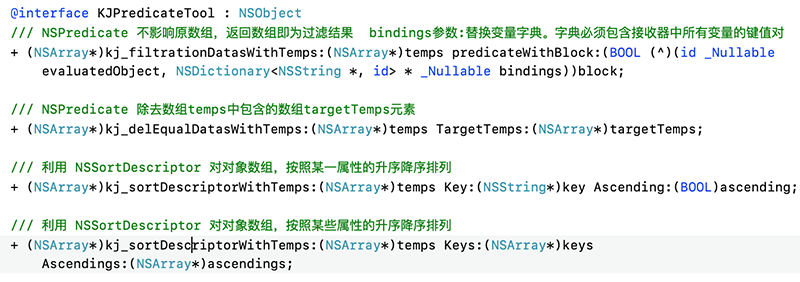

# KJPredicateDemo
利用谓词写的一套工具
<p align="left">
  
</p>

----------------------------------------
### 框架整体介绍
* [作者信息](#作者信息)
* [作者其他库](#作者其他库)
* [方法介绍](#方法介绍)
* [使用方法](#使用方法)

#### <a id="作者信息"></a>作者信息
> Github地址：https://github.com/yangKJ  
> 简书地址：https://www.jianshu.com/u/c84c00476ab6  
> 博客地址：https://blog.csdn.net/qq_34534179  

#### <a id="作者其他库"></a>作者其他Pod库
```
播放器 - KJPlayer是一款视频播放器，AVPlayer的封装，继承UIView
pod 'KJPlayer'  # 播放器功能区
pod 'KJPlayer/KJPlayerView'  # 自带展示界面

实用又方便的Category和一些自定义控件
pod 'KJEmitterView'
pod 'KJEmitterView/Function'#
pod 'KJEmitterView/Control' # 自定义控件

轮播图 - 支持缩放 多种pagecontrol 支持继承自定义样式 自带网络加载和缓存
pod 'KJBannerView'  # 轮播图，网络图片加载

菜单控件 - 下拉控件 选择控件
pod 'KJMenuView' # 菜单控件

加载Loading - 多种样式供选择
pod 'KJLoadingAnimation' # 加载控件

```

##### Issue
如果您在使用中有好的需求及建议，或者遇到什么bug，欢迎随时issue，我会及时的回复，有空也会不断优化更新这些库

#### <a id="方法介绍"></a>方法介绍
```
/// NSPredicate 不影响原数组，返回数组即为过滤结果  bindings参数:替换变量字典。字典必须包含接收器中所有变量的键值对
+ (NSArray*)kj_filtrationDatasWithTemps:(NSArray*)temps predicateWithBlock:(BOOL (^)(id _Nullable evaluatedObject, NSDictionary<NSString *, id> * _Nullable bindings))block;

/// NSPredicate 除去数组temps中包含的数组targetTemps元素
+ (NSArray*)kj_delEqualDatasWithTemps:(NSArray*)temps TargetTemps:(NSArray*)targetTemps;

/// 利用 NSSortDescriptor 对对象数组，按照某一属性的升序降序排列
+ (NSArray*)kj_sortDescriptorWithTemps:(NSArray*)temps Key:(NSString*)key Ascending:(BOOL)ascending;

/// 利用 NSSortDescriptor 对对象数组，按照某些属性的升序降序排列
+ (NSArray*)kj_sortDescriptorWithTemps:(NSArray*)temps Keys:(NSArray*)keys Ascendings:(NSArray*)ascendings;
```

#### <a id="使用方法"></a>使用方法
```
NSArray *temp = @[@{@"Apple":@"1.0",@"xx":@(1)},
	              @{@"Apple":@(2),@"xx":@(2)},
	              @{@"Apple":@"3",@"xx":@(3)},
	              @{@"Apple":@"4",@"xx":@(4)},
	              ];
NSArray *arr1 = [KJPredicateTool kj_filtrationDatasWithTemps:temp predicateWithBlock:^BOOL(id _Nullable evaluatedObject, NSDictionary<NSString *,id> * _Nullable bindings) {
//        NSLog(@"\nevaluatedObject = %@\nbindings = %@",evaluatedObject,bindings);
    NSDictionary *dic = evaluatedObject;
    return [dic[@"Apple"] integerValue] >= 2;
}];
NSLog(@"\nNSPredicate 不影响原数组，返回数组即为过滤结果 = %@",arr1);
    
NSArray *temp1 = @[@"1",@"2",@"3",@"5",@"2.5"];
NSArray *temp2 = @[@"1",@"5",@"2.5"];
NSArray *arr2 = [KJPredicateTool kj_delEqualDatasWithTemps:temp1 TargetTemps:temp2];
NSLog(@"\nNSPredicate 除去数组temps中包含的数组targetTemps元素 = %@",arr2);
    
NSArray *temp3 = @[@{@"Apple":@"1",@"xx":@"x"},
                   @{@"Apple":@"2",@"xx":@"bdq"},
                   @{@"Apple":@"2",@"xx":@"B"},
                   @{@"Apple":@"4",@"xx":@""},
                   @{@"Apple":@"2",@"xx":@"cb"},
                   @{@"Apple":@"2",@"xx":@"2"},
                   ];
/// 字母排序是根据首字母的ASC码排序
NSArray *arr3 = [KJPredicateTool kj_sortDescriptorWithTemps:temp3 Keys:@[@"Apple",@"xx"] Ascendings:@[@(NO),@(YES)]];
NSLog(@"\n利用 NSSortDescriptor 对对象数组，按照某些属性的升序降序排列 = %@",arr3);

```